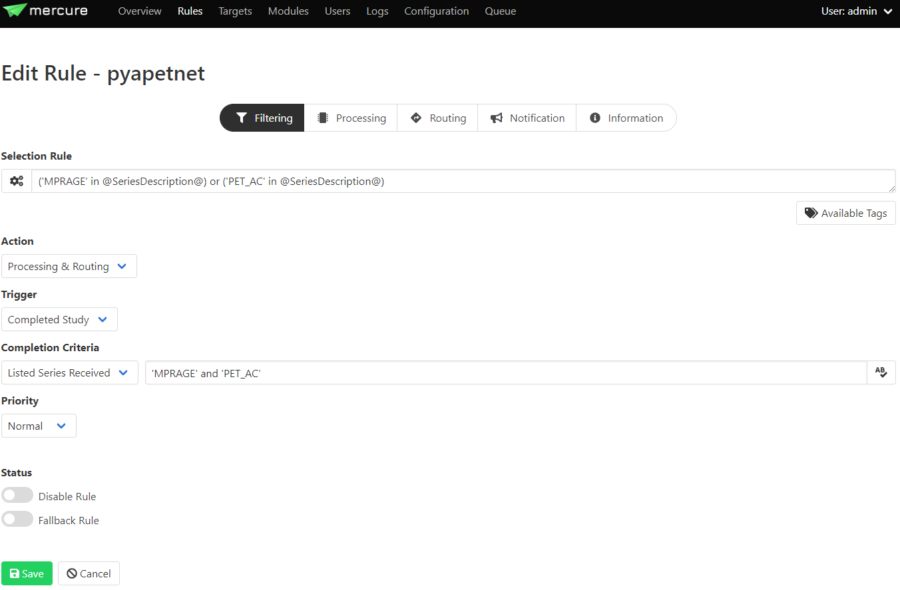

# **mercure-pyapetnet**
 

Mercure module to deploy [pyapetnet](https://github.com/gschramm/pyapetnet) - a convolutional neural network (CNN) to mimick the behavior of anatomy-guided PET reconstruction in image space. This module runs as a docker container in mercure, it can be added to an existing mercure installation using docker tag : *mercureimaging/mercure-pyapetnet*.

 

## **Installation**

### Add module to existing mercure installation
Follow instructions on [mercure website](https://mercure-imaging.org) on how to add a new module. Use the docker tag mercureimaging/mercure-pyapetnet.

 

### Build module for local testing, modification and development
1. Clone repo.
2. Build Docker container locally by running make (modify makefile with new docker tag as needed).
3. Test container :\
`docker run -it -v /input_data:/input -v /output_data:/output --env MERCURE_IN_DIR=/input  --env MERCURE_OUT_DIR=/output *mercureimaging/mercure-pyapetnet*`

 

## **Configuration**
The mercure-pyapetnet module requires that mercure provides a single MRI series and a single PET series for processing. Therefore, it is important that the processing rules are configured to filter out any surplus data received by mercure, an example is shown in the screenshot below where the rule will select series containing 'MPRAGE' or 'PET_AC' in the series description, and processing will be triggered when both series have been received. More information on mercure rule configuration can be found [here.](https://mercure-imaging.org/docs/usage.html)

 
 

 
 
